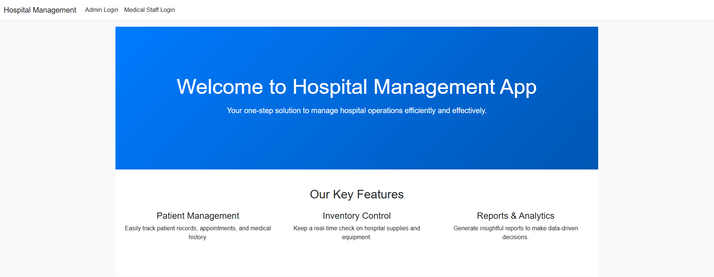

# 🏥Hospital Management

This is a Hospital Management Application built using the ASP.NET MVC framework. The app is designed to simplify and centralize administrative and medical processes in hospitals, providing features for both administrators and medical staff.

---

## 🌞Core features
### Admin Login (Application Owner)
- Admins are responsible for creating and managing hospitals within the app.
- Admins can:
    - Add and manage hospital departments.
    - Manage medical staff information (e.g., doctors, specialists).
### Medical Staff Login (Doctors)
- Medical staff have dedicated access to:
    - Manage patient details, including medical records.
    - View and update appointments.
    - Access information about their assigned departments.
### General Features
- Login Functionality: Secure login system for admins and medical staff.
- Department Management: View and organize hospital departments.
- Staff and Patient Overview: Display lists and details of medical staff and patients.

---

## 🛠️ Features in Development (TODO)
- Hospital Inventory Control: Manage hospital inventory items such as medical supplies, equipment, and consumables.
- Patient Appointments Calendar: A visual calendar feature for managing patient appointments efficiently.

---

## 💻 Technology Stack
- Framework: ASP.NET MVC (Model-View-Controller)
- Database: SQLite

---

## 🚀 Status
The application is currently in development, with core functionalities operational and additional features being actively worked on. Feedback and contributions are welcome as the project evolves!

---

## 🐋Run Instructions
> docker build -t hospital-management:latest .

> docker run --name hospital-management -p 8080:8080 -p 8081:8081 hospital-management:latest
 
### 🪪Login credentials:
### Admins:

User: Alex    | Pass: 1234

User: Matei   | Pass: 5678

### Medical Staff:

User: Sara    | Pass: 12

User: Carina  | Pass: 23

